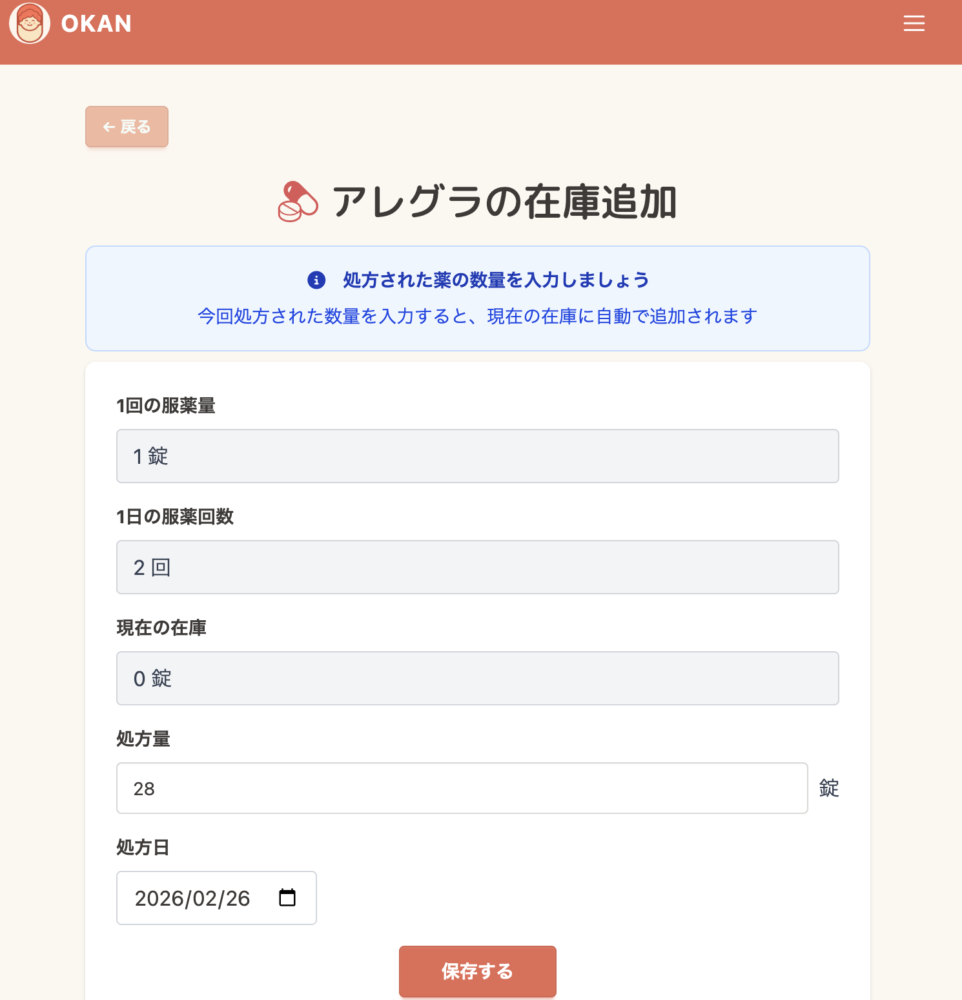
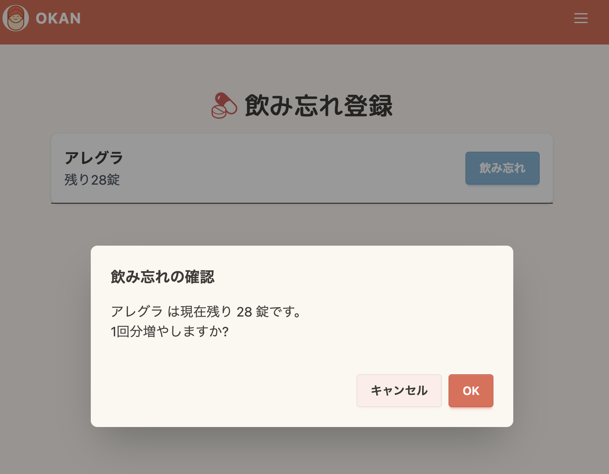
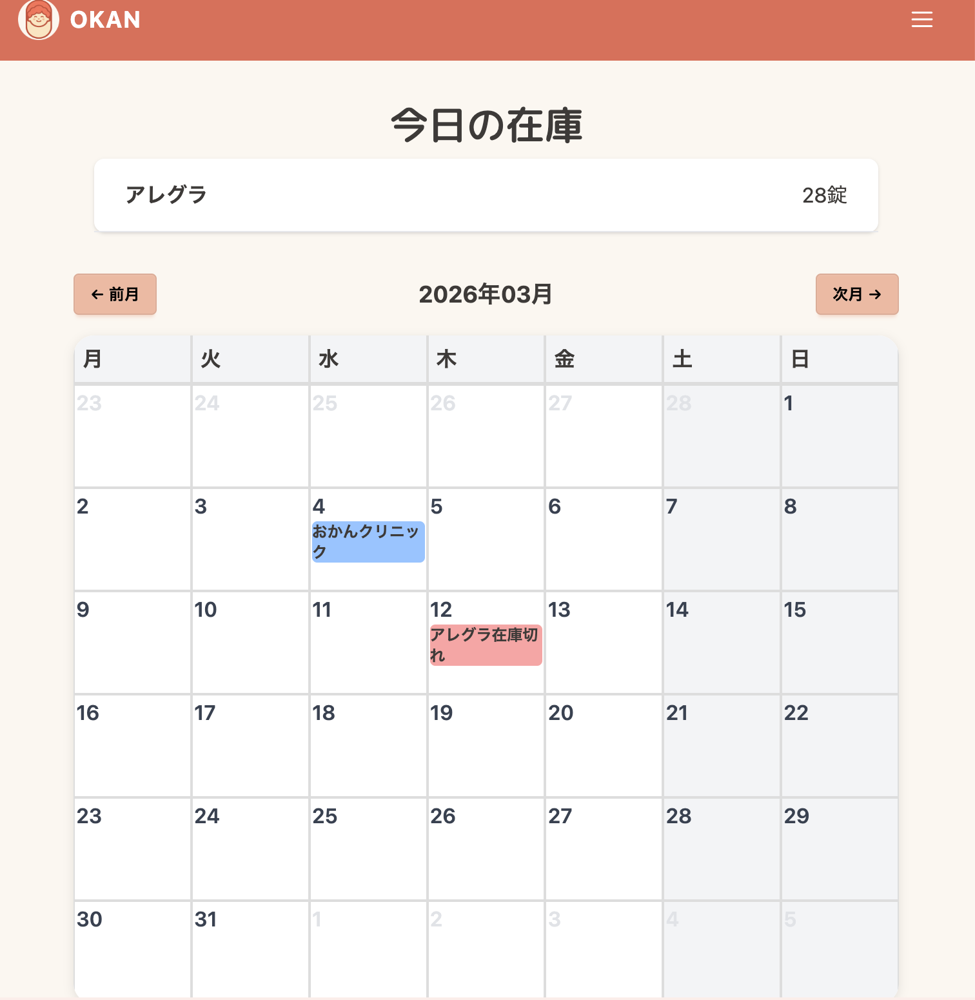
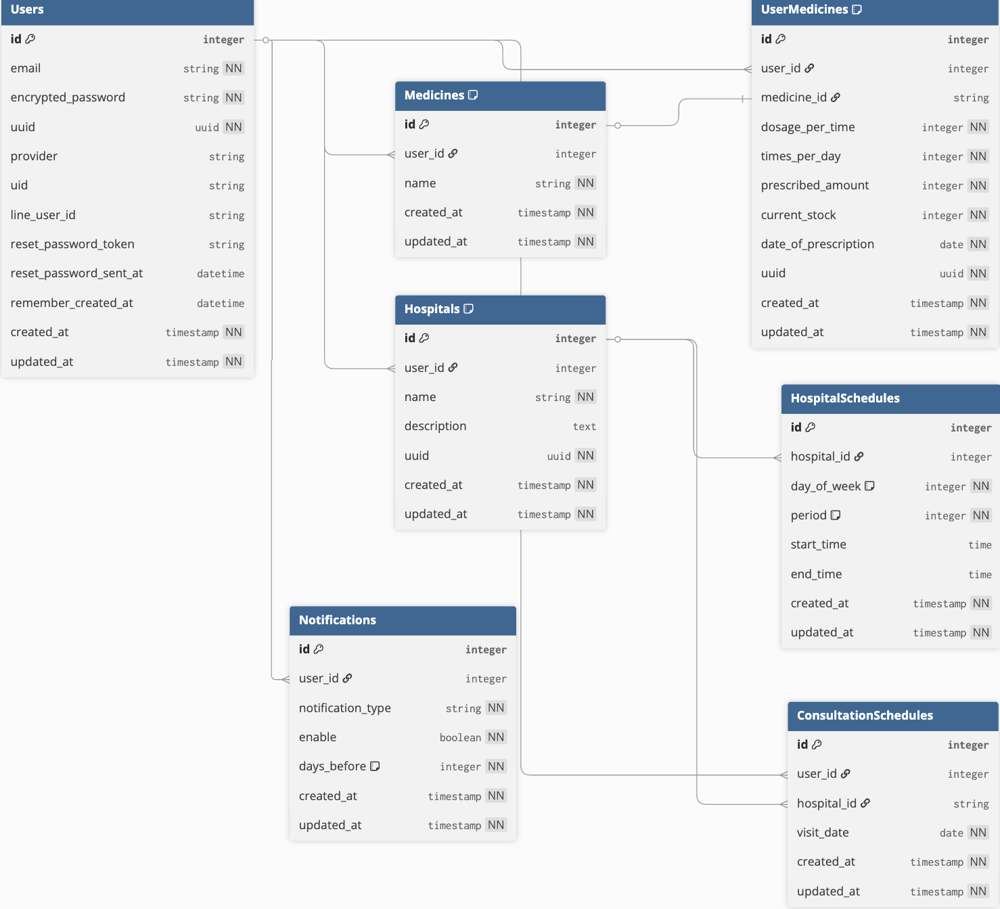

# OKAN(お薬管理アプリ)

## サービス概要

定期通院が必要な方の「薬切れによる急な通院」を防ぐアプリです。
薬残数を管理し、最適な通院タイミングをカレンダーで可視化します。
計画的な通院により、仕事への影響を最小限に抑えます。

## アプリURL
https://okusurikanri-okan.com
　
#### お試しユーザーアカウント
- メール: okan-otameshi@sample.com
- パスワード: otameshi

## このサービスへの思い・作りたい理由

私は定期的に通院する病院が複数あり、薬の服用を毎日しています。
例えば、Aの薬は１回の通院で42錠、Bの薬は１回の通院で84錠処方され、ABどちらも1日１錠服薬します。
毎日の服薬を絶やしてはいけないため、薬が切れる前に病院に行かなくてはなりませんが、複数の病院でそれぞれ薬を処方されるため管理が難しいと感じています。
薬が残り少なくなり、次いつ薬をもらいに病院に行こうかと自分のスケジュールを確認すると、病院に行ける日までに薬が切れてしまうため、仕方なく有給を取得したり元の予定をキャンセルして通院せざるを得ません。
このような課題を解決するために、通院管理をするアプリを作ろうと考えています。
アプリで現在手元に残っている薬の数を管理、いつ薬がなくなるかをカレンダー上に表示、複数の病院の営業日時をアプリで一括表示、薬が減ってきたら通知などの機能があるアプリがあれば、自分や同じような悩みを抱えている方の課題を解決できるのではないかと思いこのサービスを考えました。

## ユーザー層について

**メインターゲット：**
フルタイムで勤務しながら定期的な通院・服薬が必要な方

**背景：**
多くの病院は平日夕方まで、土曜午前のみの診療時間となっており、フルタイム勤務者にとって仕事の都合と病院の開院時間を調整することが困難です。
特に複数の病院に通院している場合、薬切れを避けるための計画的な通院スケジュール管理が重要となります。

## サービスの利用イメージ

**日常的な薬管理：**
薬を処方された時に薬の数を登録することで、カレンダー上に「薬切れ予定日」が自動表示されます。
複数の病院・薬を一画面で管理でき、どの薬がいつ切れるかが一目で把握できます。

**計画的な通院スケジューリング：**
薬切れ予定日と各病院の診療時間・休診日を照らし合わせ、最適な通院日を事前に計画できます。
薬が少なくなったタイミングで通知が届くため、余裕を持って通院予約を取ることができます。

## サービスの差別化ポイント・推しポイント

#　機能一覧

| 新規登録画面                                                                                                 | ログイン画面                                                                                                 |
| ----------------------------------------------------------------------------------------------------------- | ---------------------------------------------------------------------------------------------------------------- |
|   |  |
| メールアドレスとパスワードで新規登録できます。Googleログイン・LINEログインにも対応しています。 | 登録したメールアドレスとパスワード、またはソーシャルアカウントでログインできます。 |

| アカウント設定画面                                                                                                  | 薬の登録画面                                                                                                     |
| -------------------------------------------------------------------------------------------------------------------- | ------------------------------------------------------------------------------------------------------------------------ |
|  |  |
| メールアドレスやパスワード変更、アカウント削除などの設定ができます。 | 薬の名前、1回の服薬量、1日の服用回数、処方量、処方日を登録できます。 |

| 薬の一覧画面                                                                                                    | 薬の詳細画面                                                                                                      |
| ---------------------------------------------------------------------------------------------------------------------------- | --------------------------------------------------------------------------------------------------------------------------- |
|  |  |　 |
| 登録した薬の一覧を確認できます。現在も在庫がある薬には服薬中バッジが表示されます。 | 登録した薬の詳細情報を確認できます。 |

| 薬の在庫追加画面                                                                                                     | 薬の飲み忘れ調整画面                                                                                                                                                 |
| ------------------------------------------------------------------------------------------------------------------------ | ---------------------------------------------------------------------------------------------------------------------------------------------------------------- |
|  |                                             |
| 処方量と処方日を追加することで登録済みの薬の在庫を追加することができます。 | 飲み忘れに気がついた時に飲み忘れボタンを押すと、1回分の薬を増やすことで手元の在庫数を調整できます。 |

| 今日の在庫表示機能                                                                                                               | 予想在庫表示画面                                                                                                     |
| ------------------------------------------------------------------------------------------------------------------------ | ------------------------------------------------------------------------------------------------------------------ |
|            |  |
| 毎日深夜0時に、前日に服薬した薬を量を自動で減算し、正確な今日の在庫数を表示します。また、カレンダーには在庫切れ予定日や通院予定日が表示されます。 | カレンダーの日付をクリックするとその日の予想在庫数を表示します。 |

| LINE通知設定画面                                                                                                                                                                                                                         | LINE通知の受信例                                                                                                                                                           |
| -------------------------------------------------------------------------------------------------------------------------------------------------------------------------------------------------------------------------------------------------- | ---------------------------------------------------------------------------------------------------------------------------------------------------------------------------- |
|                                                                                                                                  |                                                       |
| LINE連携を行い、通知タイミングを設定できます。在庫残少通知（在庫がなくなる5日前など）や通院予定日(通院予定日前日など)リマインダーの設定が可能です。 | 設定した条件に応じてLINEで通知が届きます。薬の在庫状況や通院予定日を忘れずに確認できます。 |

| 病院情報登録画面                                                                                                     | 病院情報一覧画面                                                                                                      |
| ------------------------------------------------------------------------------------------------------------------------ | ----------------------------------------------------------------------------------------------------------------------- |
|  |  |
| 病院名、メモ、診察時間などの情報を登録できます。 | 登録した病院の一覧を確認できます。各病院の登録した情報を確認できます。 |

| 次回通院予定登録画面                                                                                                                                                             | 通院予定一覧画面                                                                                              |
| ---------------------------------------------------------------------------------------------------------------------------------------------------------------------------------- | ----------------------------------------------------------------------------------------------------------------------- |
|                                                                  |  |
| 次回通院予定日を登録できます。病院詳細画面で日時を選択すると、カレンダーに自動反映されます。 | 今後の通院予定を一覧で確認できます。 |

| 通院予定詳細画面                                                                                                     | ダークモード画面                                                                                                                                                     |
| ---------------------------------------------------------------------------------------------------------------------- | ---------------------------------------------------------------------------------------------------------------------------------------------------------------------- |

## 使用技術
| 項目 | 技術 |
| --- | --- |
| バックエンド | Ruby 3.3.10 / Ruby on Rails 7.2.3 |
| フロントエンド |  TailwindCSS / daisyUI /Hotwire（Turbo, Stimulus） |
| データベース | PostgreSQL |
| 認証 | Devise / OmniAuth（Google, LINE） |
| タスク管理 | Whenever / GitHub Actions（cron） |
| 外部API | LINE Messaging API |
| 開発環境 | Docker |
| 本番環境 | Render / neon(db) |
| その他 | rubocop / RSpec / FactoryBot|

### 競合サービス分析
**既存の服薬管理アプリ（NOBORI、EPARKお薬手帳、FutasajiLLC等）の特徴**
- 服薬するたびに手動で記録する方式
- 過去の服薬履歴や医療費記録が中心

### 当サービスの差別化ポイント

#### 1. 自動残薬管理
**既存サービス**: 服薬の都度、手動記録が必要

**当サービス**: 服薬を前提とした自動減算システム

**優れている理由**:
- 毎日の入力負担軽減（飲み忘れ時のみ操作）
- 継続率の向上（手動記録の煩わしさを解消）
- リアルタイムでの正確な残薬数把握

#### 2. タスク管理
**既存サービス**: 過去の記録・現在の状況管理が中心

**当サービス**: 「いつ病院に行くか」の予測・計画に特化

**優れている理由**:
- カレンダー上での視覚的な通院予定管理
- 薬切れ前の予防的な通院計画
- フルタイム勤務者のスケジュールとの連携を考慮

### 画面遷移図
Figma：https://www.figma.com/design/TKYTGl8lAQCmwPjlHiZIoV/%E9%80%9A%E9%99%A2%E7%AE%A1%E7%90%86%E3%82%A2%E3%83%97%E3%83%AA%E3%80%80%E7%94%BB%E9%9D%A2%E9%81%B7%E7%A7%BB%E5%9B%B3?node-id=0-1&p=f&t=oTOPyTQU20oXrSg8-0

### ER図

詳細なテーブル定義は [こちら](docs/table_definition.md) をご覧ください。

## 機能設計の方針

### 編集機能について
本アプリでは、薬の情報の編集機能を意図的に実装していません。

**理由：**
- 在庫追加、飲み忘れの機能があり、編集機能との違いがわかりにくい
- 入力ミスは頻度が低く、削除→再登録の方がユーザーにとって分かりやすい
- 処方日の変更が在庫計算に大きく影響するため、データ整合性の維持が困難

**代替手段：**
- 入力ミスがあった場合は、削除後に再登録をしてもらいます。
